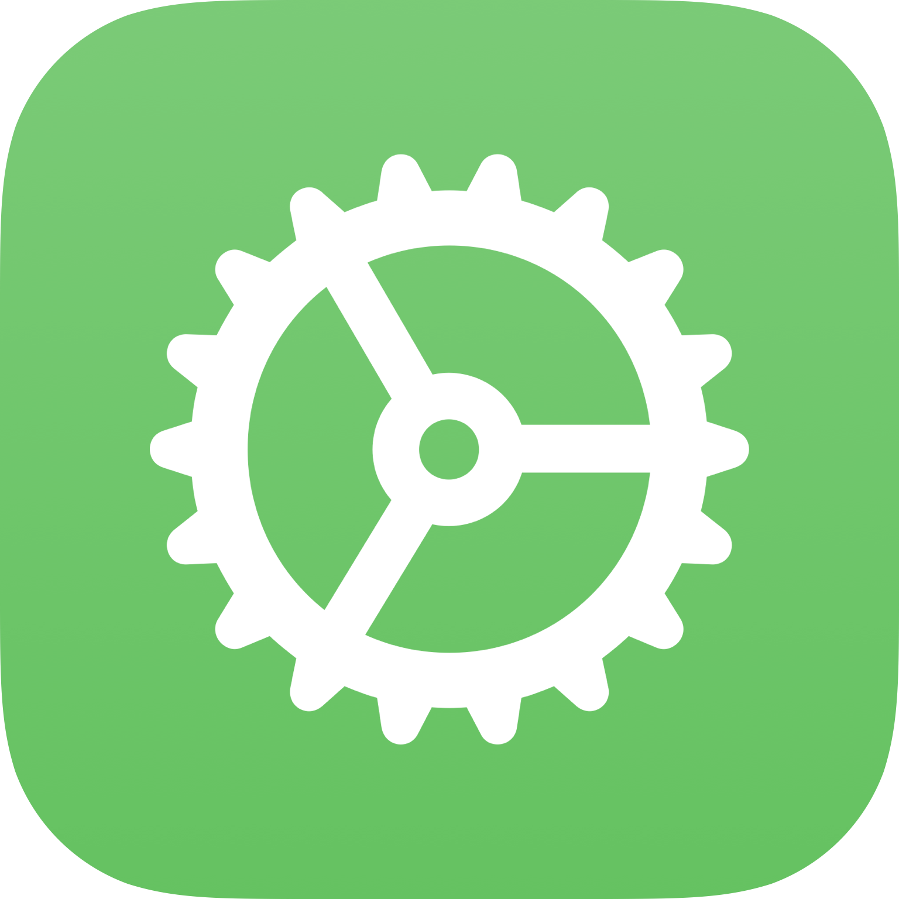

 </a>

<h3 align="center">⚙️ DeveloperKit</h3>

DeveloperKit is an shortcut that brings many tools into one shortcut without having to spend long times copying shortcuts.

## 🚀 Summary

- [About the project](#-about-the-project)
 - [Functions](#-functions)
- [Requests](#-requests)
  - [Options](#-options)
- [Download](#-download)

## 📖 About the project

DeveloperKit is a quick way to use many tools together without spending a lot of time copying shortcuts.

## 🪄 Functions

- **Version**: Gets the version of DeveloperKit. Can be useful if the user doesn’t have the latest features.

- **Ping**: Test the milliseconds of your WiFi. Needs an app called "a-Shell mini".
Options: IP (the router ip)

- **ConnectedToWifi?**: Is the user connected to an WiFi network.

- **ConnectedToInternet?**: Is the user connected to the internet.

- **Location**: Gets the location of the user more faster.

- **RunJavaScript**: Runs JavaScript remotely on your device.
Options: code (the JavaScript code)

- **Timezone**: Gets the user’s timezone. 

- **CensorText**: Censor insults from an text.
Options: text (the text to censor).

- **UserLanguage**: Gets the user’s language.

- **Check For Updates**: Checks for updates using RoutineHub’s API.
Options: ID (RoutineHub’s Shortcut ID), Version (RoutineHub’s Shortcut Version)
